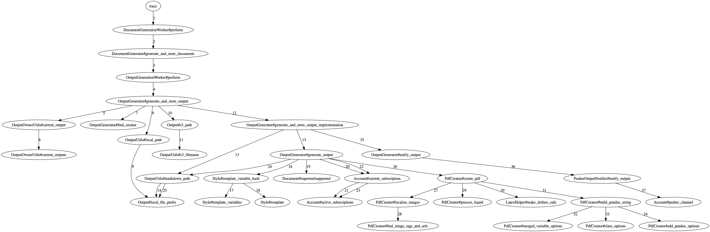
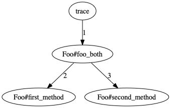

# TraceGraph

TraceGraph gives you visibility into the control flow of your application. Rather than read all the code
trying to form a mental picture of it, let TraceGraph draw you a picture like this:



## Installation

Add this line to your application's Gemfile:

```ruby
gem 'trace_graph'
```

And then execute:

    $ bundle

Or install it yourself as:

    $ gem install trace_graph

## Usage

A simple use might look like this:

```ruby
foo = Foo.new
tracer = TraceGraph::Tracer.new({ included_paths: ["foo"], png: 'foo_trace.png' })
tracer.trace{ foo.foo_both }
```

For the `Foo` class shown below you'd see output like this in your console:

```
trace
└─Foo#foo_both
  ├─Foo#first_method
  └─Foo#second_method
```

And a graph like this would be generated at `foo_trace.png`





```ruby
# foo.rb
class Foo
  def first_method
  end

  def second_method
  end

  def foo_both
    first_method
    second_method
  end
end
```

## Options

When constructing a tracer you can pass in a number of options to control what shows up
in the graph.

* `included_paths` - By default TraceGraph will not capture any lines, so you need to tell it
  what files you're interested in. If your app lives in a directory called `my_app` and you
  want to see everything in your app you could pass `["my_app"]`. You can include as many paths
  as you need in the array. Default value is an empty array. If you weant to see _everythin_ you
  can pass `nil`. (For something like a Rails app you probably really don't want to see everything.)

* `excluded_paths` - A list of paths to exclude. Maybe `["my_app/some_utility_helper"]`. Default
  value is `nil`.

* `png` - A string path where to write a png graph.

* `mark_duplicate_calls` - Either `true` or `false`. Default value is `false`. When `true` any
  repeat calls to a method will be marked with a count, and will be colored red on the png.

* `show_arguments` - Either `true` or `false`. Default value is `false`. When `true` the arguments
  passed to each method call will be shown.

* `show_return_values` - Either `true` or `false`. Default value is `false`. When `true` the return
  values from each method call will be shown.

## Development

After checking out the repo, run `bin/setup` to install dependencies. Then, run `rake spec` to run the tests. You can also run `bin/console` for an interactive prompt that will allow you to experiment.

To install this gem onto your local machine, run `bundle exec rake install`. To release a new version, update the version number in `version.rb`, and then run `bundle exec rake release`, which will create a git tag for the version, push git commits and tags, and push the `.gem` file to [rubygems.org](https://rubygems.org).

## Contributing

Bug reports and pull requests are welcome on GitHub at https://github.com/jagthedrummer/trace_graph. This project is intended to be a safe, welcoming space for collaboration, and contributors are expected to adhere to the [Contributor Covenant](http://contributor-covenant.org) code of conduct.

## License

The gem is available as open source under the terms of the [MIT License](https://opensource.org/licenses/MIT).

## Code of Conduct

Everyone interacting in the TraceGraph project’s codebases, issue trackers, chat rooms and mailing lists is expected to follow the [code of conduct](https://github.com/[USERNAME]/trace_graph/blob/master/CODE_OF_CONDUCT.md).
